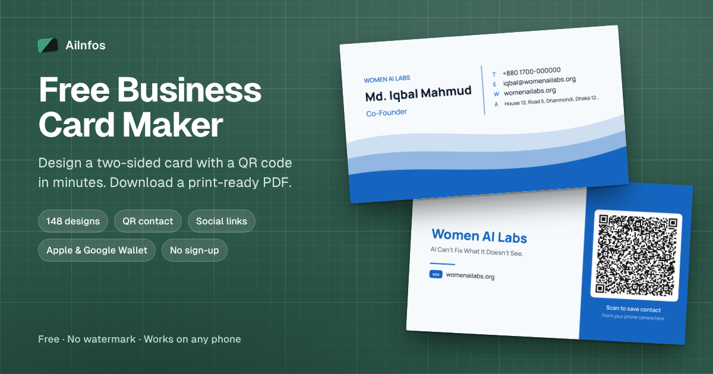

# Free Business Card Maker with QR Code, Wallet Pass and Print-Ready PDF

A free, open-source **business card maker** by [AiInfos](https://aiinfos.com). Design a two-sided business card in the browser, add a **vCard QR code**, download a **300 dpi print-ready PDF** with bleed, and save the card to **Apple Wallet or Google Wallet**. No sign-up, no watermark and no image files: every design is drawn in code. The app is a single HTML file; the optional wallet feature adds one small PHP script.

**Live demo:** https://iqbalmahmud.com/business-card-maker/



## Features

- **148 card designs:** 8 classic layouts plus 140 designs in 35 styles (waves, gold frames, botanical, low-poly, circuit, confetti and more), all drawn in code. The design browser previews every design with your own details, with search, categories and 12 designs per page
- **4 back styles:** solid, lines, dots and light, with logo, company name and tagline
- **QR code business card:** the back can hold a vCard (scan to save the contact) or a website link
- **20 color palettes** plus custom accent, paper and ink colors
- **Typography controls:** 4 font pairings and adjustable size and weight for name, job title, company, contact details and tagline
- **Show or hide** phone, email, website, address and contact labels on the front
- **Print-ready PDF:** 2 pages (front and back), 300 dpi, optional 3 mm bleed, with TrimBox and BleedBox set for print shops
- **PNG export** of each side at 300 dpi
- **Standard business card sizes:** 3.5 × 2 in (88.9 × 50.8 mm), 85 × 55 mm and 90 × 55 mm
- **Trim and safe-zone guides** in the live preview
- **Logo upload** (PNG, JPG or SVG)
- **Bangla (Bengali) support** using Hind Siliguri
- **Add to phone wallet:** Apple Wallet and Google Wallet passes with the contact QR code, in their own section right after Print: free through Apple Wallet's Create a Pass (iOS 27+) and Google Wallet's Everything else, or one-tap with the PHP script and your own Apple/Google credentials ([WALLET-SETUP.md](WALLET-SETUP.md))
- **Save contact (.vcf)** for any phone
- **Mobile-friendly** layout with a pinned preview and a bottom download bar; new pages of designs open at the top of the list
- **Installable PWA** that works offline after the first visit
- **Private by design:** designs are saved only in the visitor's browser for 30 days after their last change; card details leave the device only when the visitor adds the card to a wallet

## How to make a business card

1. Type your name, job title, company, phone, email, website and address.
2. Upload a logo, or let the card use your company name or initials.
3. Tap **Browse all 148 designs** and pick one. Every preview already shows your details.
4. Adjust the typeface, colors and text sizes, and choose what goes on the back.
5. Under **Print**, choose the card size and keep the 3 mm bleed on for print shops.
6. Download the PDF or PNGs, or use **Add to phone wallet** to keep the card on your phone.

## Quick start

There is no build step and nothing to install.

```bash
git clone https://github.com/YOUR-USERNAME/free-business-card-maker.git
cd free-business-card-maker
python3 -m http.server 8080
```

Open http://localhost:8080. The service worker (offline mode and install) only runs on `https://` or `localhost`.

To try the wallet endpoint locally, run PHP's built-in server instead: `php -S localhost:8080`.

## Project structure

```
free-business-card-maker/
├── index.html        # the whole app: HTML, CSS and JavaScript in one file
├── api/
│   ├── wallet.php         # creates Apple Wallet (.pkpass) and Google Wallet passes
│   ├── config.sample.php  # copy to config.php and add your credentials
│   └── assets/            # Apple Wallet pass icons
├── WALLET-SETUP.md   # step-by-step Apple and Google setup
├── manifest.json     # PWA name, colors and icons
├── sw.js             # service worker for offline use
├── og-image.png      # 1200 × 630 social preview image
├── sitemap.xml       # sitemap for search engines
├── icons/            # app icons and favicon
├── README.md
└── LICENSE
```

## Deployment

### Any web server (Nginx, Apache, CloudPanel, cPanel)

Upload the folder to your site, for example as `/business-card-maker/`. On a WordPress site this works without changes, because the web server serves real files before WordPress handles the request.

Recommended Nginx rule so updates to the service worker reach installed copies:

```nginx
location = /business-card-maker/sw.js {
    add_header Cache-Control "no-cache";
}
```

### GitHub Pages

1. Push the repository to GitHub.
2. Go to **Settings → Pages**, choose **Deploy from a branch**, and select `main` and `/ (root)`.
3. The app is published at `https://YOUR-USERNAME.github.io/free-business-card-maker/`.

### Netlify, Vercel or Cloudflare Pages

Create a new site from the repository. Leave the build command empty and set the publish directory to the repository root.

## Configuration

**Domain.** The public address is set to `https://iqbalmahmud.com/business-card-maker/` in `index.html`, `sitemap.xml` and this README. It is used by the canonical link, Open Graph tags and structured data. To host the app somewhere else, replace it everywhere:

```bash
grep -rl "https://iqbalmahmud.com/business-card-maker/" . | xargs sed -i 's#https://iqbalmahmud.com/business-card-maker/#https://example.org/business-card-maker/#g'
```

On macOS use `sed -i ''` instead of `sed -i`.

**Default card details.** The details shown on first visit are in the `EXAMPLE` object near the top of the main script in `index.html`.

**Updating the app.** After changing `index.html`, open `sw.js` and bump `VERSION` (for example `bcm-iqbal-v8` → `bcm-iqbal-v9`) so installed copies refresh.

## SEO

The page is built to be easy for search engines to understand:

- Descriptive `<title>`, meta description, canonical URL and a single `<h1>`
- Open Graph and Twitter Card tags with a 1200 × 630 preview image
- `WebApplication` and `FAQPage` structured data (JSON-LD) that matches the visible FAQ
- Crawlable text content: features, a how-to guide, printing tips and an FAQ
- Author and contributor credits in the structured data, matching the visible footer
- Mobile-friendly, served over HTTPS, no layout shift from ads or pop-ups

After deploying:

1. Add the page URL to your site's main sitemap, or submit `sitemap.xml` in [Google Search Console](https://search.google.com/search-console).
2. Use **URL Inspection → Request indexing** for the page.
3. Test the structured data with the [Rich Results Test](https://search.google.com/test/rich-results).
4. Link to the tool from your homepage, blog posts and social profiles. Links from relevant sites matter more for ranking than on-page tags.

## Apple Wallet and Google Wallet

Wallet passes must be signed with keys that only you hold, so they are created on your server by `api/wallet.php` (PHP 8, no Composer packages):

- **Apple Wallet:** builds a generic `.pkpass` with your name, title, company, contact details and a vCard QR code, signs it with your Pass Type ID certificate and the Apple WWDR G4 certificate, and hands it to Safari.
- **Google Wallet:** creates a Generic pass through the Google Wallet API with a service account, then returns a short "Save to Google Wallet" link.

**Free route, no server or API needed:** when the PHP script isn't set up (including on GitHub Pages), the wallet buttons show the card's contact QR code with steps for each wallet's built-in tools: **Create a Pass** in Apple Wallet (iOS 27 and later) and **Everything else** in Google Wallet on Android. There is also a **Save contact (.vcf)** button that works on every phone.

Follow [WALLET-SETUP.md](WALLET-SETUP.md) to get the certificates and keys for one-tap passes. GitHub Pages, Netlify and other static hosts cannot run PHP; on those, both buttons use the free route above.

## How it works

- Cards are drawn on an HTML `<canvas>` in millimetres and rendered at 300 dpi for export.
- The PDF is written directly in the browser (one JPEG per page, with TrimBox and BleedBox), so no PDF library is needed.
- QR codes are generated in the page by [qrcode-generator](https://github.com/kazuhikoarase/qrcode-generator), inlined in `index.html`.
- Fonts load from Google Fonts: Syne, DM Sans, Cormorant Garamond, Work Sans, Manrope, Hind Siliguri and IBM Plex.
- Designs are stored in `localStorage` and expire 30 days after the last change.

## Browser support

Current versions of Chrome, Edge, Firefox and Safari on desktop, Android and iOS. Some in-app browsers (inside social media apps) block downloads; in that case the PDF opens in a new tab so it can still be saved.

## Contributing

Issues and pull requests are welcome. Ideas: more layouts, a sheet layout with several cards per page for home printing, CMYK-friendly color presets and more languages.

## Credits

- Built by [Iqbal Mahmud](https://www.IqbalMahmud.com), main developer. A free tool by [AiInfos](https://aiinfos.com).
- Inspired by [Dawn C Simmons](https://www.DawnCSimmons.com), who suggested the idea.

- QR code generation: [qrcode-generator](https://github.com/kazuhikoarase/qrcode-generator) by Kazuhiko Arase, MIT License. "QR Code" is a registered trademark of DENSO WAVE INCORPORATED.
- Fonts: [Google Fonts](https://fonts.google.com), SIL Open Font License.

## License

[MIT](LICENSE)
